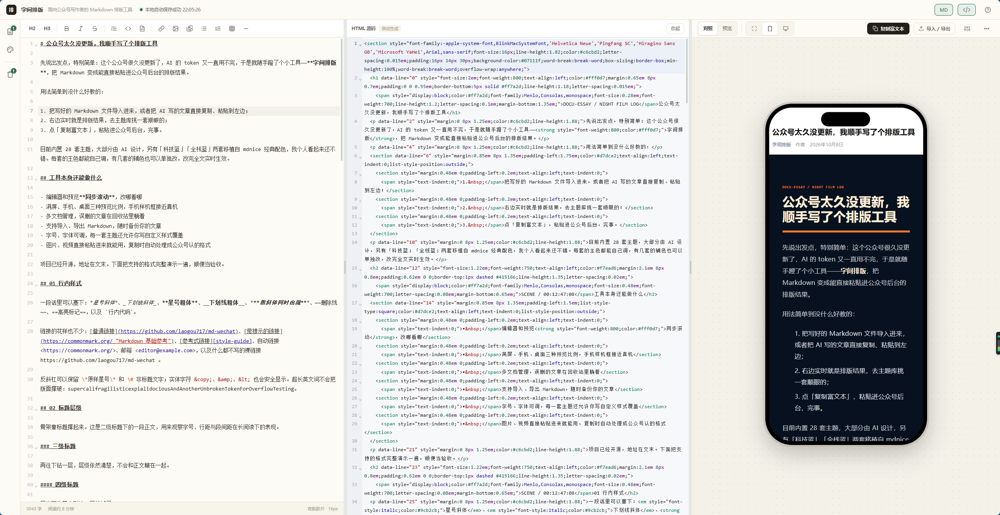

# wechat-article

[](https://github.com/laogou717/md-wechat/blob/main/LICENSE)
[](https://nodejs.org/)

面向公众号写作者的 Markdown 排版工具：左边写 Markdown，右边实时预览公众号效果，一键复制富文本，直接粘贴进公众号后台，样式不丢失。

> 本项目基于 [laogou717/md-wechat](https://github.com/laogou717/md-wechat) 修改而来，界面设计、核心功能与大量实现均来自原仓库，感谢原作者的开源工作。



## 功能特性

### 编辑与预览
- Markdown 实时渲染，编辑器与预览同步滚动
- 三栏工作区：**写作 / HTML 源码 / 效果预览**。中间栏实时显示渲染后的 HTML 并可直接编辑（改哪看哪，手改优先；正文或排版一变会自动重新生成，也可一键还原），宽度可拖拽。顶栏 **`MD` / `HTML` 两个按钮是多选开关**，预览恒显示，旁边的栏按按下的按钮决定：只按 `MD` → 预览 + 写作列，只按 `HTML` → 预览 + 源码列，两个都按 → 三栏全开，两个都不按 → 纯预览
- 满屏 / 手机 / 桌面三种预览比例，手机样机框接近真机效果
- 代码块高亮（22 种常用语言，样式全部内联）、表格、嵌套引用、分割线等完整语法支持

### 主题与排版
- 28 套排版主题一键换肤，悬停卡片即可实时试看；每套主色可自定义，部分主题的辅色可单独调整
- 字号、字体可调，支持按主题覆盖自定义 CSS
- 图片画廊三种模式：**拼贴**（主图 + 右列裁切填充，拖拽边界自由微调、底边始终齐平）、**网格**（1:1 / 4:5 / 3:4 统一裁切，公众号后台实测支持）、**单列**
- 外链转脚注（可选开关）：公众号不支持外链，粘贴后链接会失效；开启后所有外部链接自动搬到文末【参考资料】并配 `[n]` 角标，网址以纯文本保留可查可搜，微信内链（`mp.weixin.qq.com`）保持可点击

### 媒体处理
- 剪贴板 / 拖放 / 文件选择三种方式插入图片，字节存本地 IndexedDB，文档只留短引用，复制到公众号时自动还原
- 可选图床（SM.MS / GitHub / 自定义接口），粘贴即上传并插入公网链接，失败自动回落本地存储
- 视频处理：本地视频预览可播放；复制时 ≤7.5MB 的视频内联带走（按公众号正文 10M 上限反推），更大的自动转为带文件名的占位卡，粘贴后在公众号后台插入真视频（视频不像图片会被微信转存，必须走后台上传转码审核——平台限制，非工具问题）

### 文档管理
- 多文档管理、回收站、本地自动保存
- 导入 / 导出 Markdown，随时备份文章
- 顶栏「?」查看快捷键与操作提示（复制排版、保存、图片拖拽、段落定位等）

## 技术栈

- **Vue 3 + Vite**：全组件化前端，构建产物为纯静态文件
- **CodeMirror 6**：编辑器内核
- **markdown-it + highlight.js**：Markdown 渲染与代码高亮，复制时样式全部内联
- **无后端**：全部数据保存在浏览器本地（localStorage / IndexedDB），静态托管即可运行

## 快速开始

### 方式一：一键启动（推荐给新手）

| 系统 | 操作 |
| --- | --- |
| macOS | 双击 `start.command`（首次如提示无法打开，在文件上右键 → 打开） |
| Windows | 双击 `start.bat`（如弹出 SmartScreen，点「更多信息 → 仍要运行」） |

脚本会自动检查 Node.js；如果电脑没装，会从国内镜像下载免安装版放到项目目录（`.node-runtime/`，不污染系统），然后装依赖、起服务、开浏览器，全程无需管理员权限。

### 方式二：手动安装

需要 [Node.js 18](https://nodejs.org/) 及以上。

```bash
git clone https://github.com/<your-username>/wechat-article.git
cd wechat-article

npm install      # 安装依赖
npm run dev      # 启动开发服务器，默认 http://localhost:5173
```

## 构建与测试

```bash
npm run build    # 构建生产版本到 dist/
npm run preview  # 本地预览构建产物
npm test         # 运行测试（node --test）
```

测试覆盖渲染器的微信兼容性（嵌套列表不输出原生 `<ul>/<ol>`、XSS 转义、外链转脚注）、HTML 格式化的幂等与无损、主题与样章完整性，以及三栏布局与旧版设置迁移。

## 使用方法

1. 在左侧编辑器粘贴 Markdown，或点击「导入 Markdown」选择本地 `.md` 文件
2. 在右侧主题库选择主题，按需调整主色、辅色、字号
3. 点击「复制富文本」，到公众号后台粘贴即可发布

## 浏览器要求

推荐 Chrome / Edge，Safari 也能正常使用全部功能。

## 数据与隐私

- 纯前端应用，**无后端、无埋点、无账号体系**：文章、图片、设置全部保存在浏览器本地（localStorage / IndexedDB），不上传任何服务器
- 可选的「图床」功能需要你主动配置 Token，凭据同样只存本机浏览器（明文 localStorage），仅在你手动触发上传时才会把媒体发往对应服务
- 关闭浏览器标签页或清理站点数据即可彻底抹除所有内容

## 部署上线

纯静态产物（`npm run build` 输出 `dist/`），部署到 Cloudflare Pages、Vercel、GitHub Pages 等任意静态托管即可，无需任何服务端配置。

## 致谢

- 本项目派生自 [laogou717/md-wechat](https://github.com/laogou717/md-wechat)，原始设计、核心功能与大量实现均来自该仓库，在此致以谢意。
- 手机样机框素材版权归 FrameUp 原作者所有，许可见 `public/device-frames/FRAMEUP-LICENSE.txt`。

## License

[MIT](https://github.com/laogou717/md-wechat/blob/main/LICENSE)
